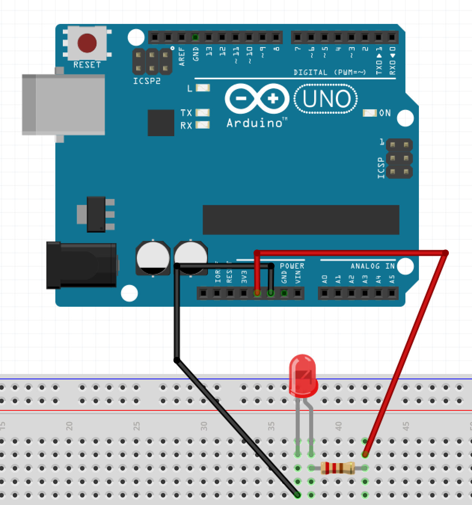
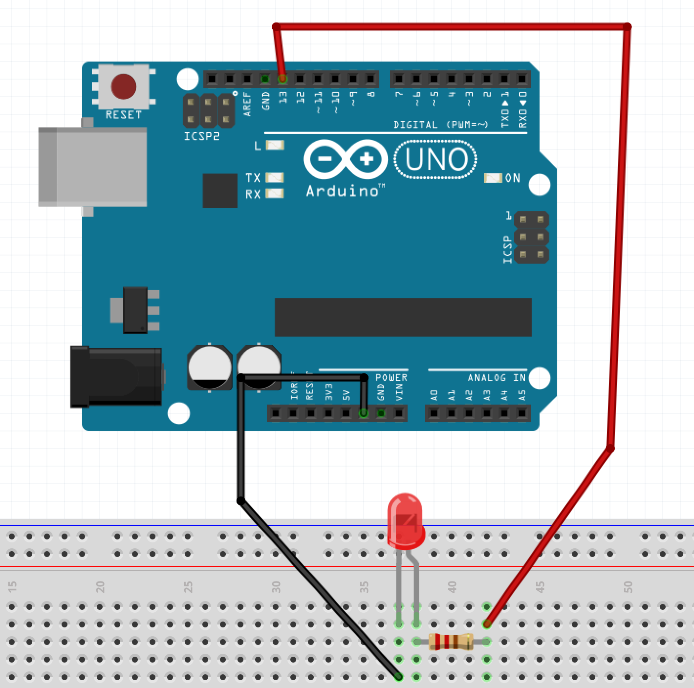
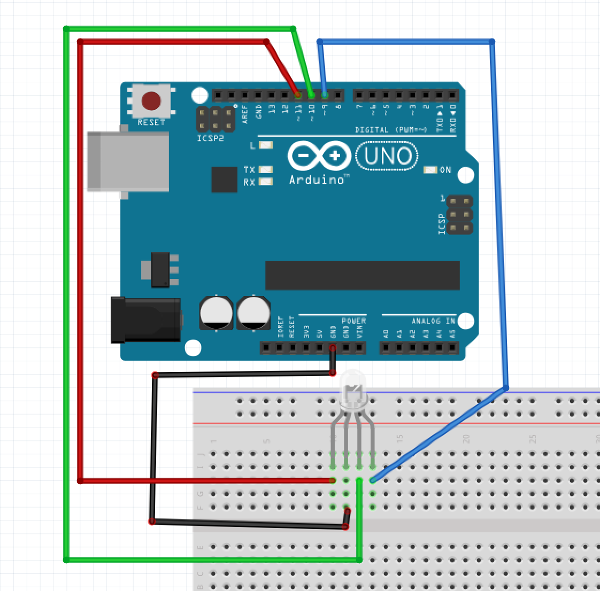
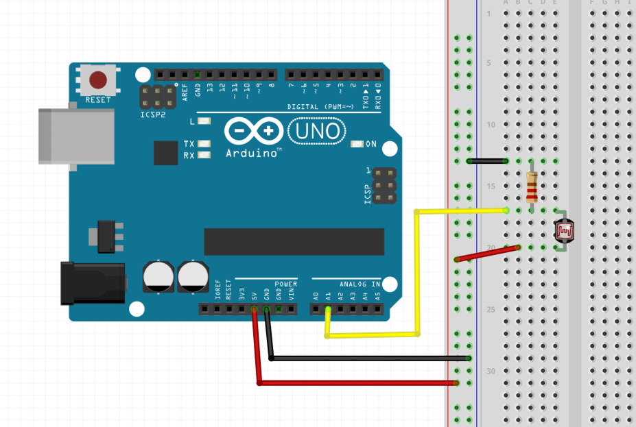

# Hardware hacking
### Objectives
*After this lesson, students will be able to:*

- Explain how an electrical circuit works.
- Follow a wiring diagram for an electronic component.
- Use the Arduino platform to program wired circuits.

## Intro
### What is a circuit?

This can become a pretty long topic but here's all you really need to know about circuits:

A circuit is a closed loop through which current can flow. 


For a much deeper dive: <a href="https://learn.sparkfun.com/tutorials/what-is-a-circuit">What is a circuit? - SparkFun</a>

### A very simple circuit
In each of your kits, you should have a small coin-cell battery (3 volts) and some LEDs.

Wedge the legs of the LED around the battery such that the positive end of the LED (the longer leg) touches the + side of the battery, and the negative end (shorter leg) touches the - side.

### What is a microcontroller?
A microcontroller is basically just a very tiny computer which you can use to program interactions between connected components in a circuit you build.  While it's entirely possible to make an LED blink on/off without the use of any software, what we know as developers is that symbolic systems of representations are never a bad thing -- and if anything, being able to use software to interface with our circuits allow us to approach our designs with all the same principles of modularity and re-usability as we've done so with web apps.

### What is Arduino?
Arduino is an open-sourced prototyping platform for electronics that consists of a microcontroller and a programming interface that makes it extremely easy to get started with hardware hacking.

To get started, we'll need to <a href="https://www.arduino.cc/en/Main/Software">install the Arduino software</a>.

## A very simple Arduino circuit 

Follow the wiring diagram below and plug in the Arduino.  You should see your LED light up!



### Our first programmed circuit: Blink

That's all well and good but we could have easily done this with just a coincell battery.  If we change our wiring just a tiny bit, we can actually program the circuit to blink the LED on/off.

Follow the wiring diagram below, and then open up the Arduino program.



Open up a new sketch and write the following:

```
// the setup function runs once when you press reset or power the board
void setup() {
  // initialize digital pin 13 as an output.
  pinMode(13, OUTPUT);
}

// the loop function runs over and over again forever
void loop() {
  digitalWrite(13, HIGH);   // turn the LED on (HIGH is the voltage level)
  delay(1000);              // wait for a second
  digitalWrite(13, LOW);    // turn the LED off by making the voltage LOW
  delay(1000);              // wait for a second
}
```

Press the Upload button (=> in the top left); you may need to tell the Arduino program what kind of board you have (Arduino Uno) under Tools >> Board and what port it's connected on (dev/tty.usbmodem...) under Tools >> Port.


### Programming in Arduino

There are two functions that are always required for an Arduino program: `setup` and `loop`.  

`setup` is where you put code that runs once at the start of the Arduino -- here, we are setting up our board to be able to send output on pin 13.

`loop` is where you put code that runs, yep, on a loop, while the Arduino board is on.  

Some of this should look kind of familiar to you; other parts won't.  The Arduino language can be thought of as a set of C/C++ functions that you have access to.  That means that by programming for Arduino, you are essentially programming C/C++.

This language is pretty similar to JavaScript even in syntax, but one thing that is definitely very different is in how variables/functions are written.  C/C++ requires that you tell it what **type** of value you expect a variable to store as well as what type you expect a function to return.  Where you don't expect to return anything, you can use `void` (as we've done for both `setup()` and `loop()`).

## Outputs 
### RGB LED
Here's the wiring diagram for an RGB LED:



The trick with an RGB LED is that now we want to control the amount of Red, Green, and Blue that is produced by the light.  To do so, we will a function called `analogWrite` which will allow us to control the amount of light each Red, Green, and Blue diodes produce on a scale from **0 to 255**.  

The code below, for example, should produce a mixture of red and blue:

```
void setup() {
  // initialize digital pins 9, 10, 11 as an output.
  pinMode(11, OUTPUT);
  pinMode(10, OUTPUT);
  pinMode(9, OUTPUT);
  
}

void loop() {
  analogWrite(11, 255);
  analogWrite(10, 0);
  analogWrite(9, 255);  
}
```

### Piezo buzzer 
Piezo buzzers are tiny components that can play sound.

<a href="https://www.arduino.cc/en/Tutorial/toneMelody">Playing a tone with a piezo buzzer</a>


```
void setup() {
  // initialize digital pin 8 as an output.
  pinMode(8, OUTPUT);

  
}

void loop() {
  // plays a frequency of 440 hz on pin 8 
  tone(8, 440);
}
```

<a href="http://www.phy.mtu.edu/~suits/notefreqs.html">Note frequency chart</a>

## Inputs 


### Photocell resistor


A photocell resistor measures the amount of light that its sensing.  Rather than send or **write** values out to the photocell resistor, instead we want to **read** values from it.  Eventually, we will write some code that will use the values from the resistor to change something else in our circuit (the Piezo buzzer, perhaps), but for now, it would be nice to **see** what the values are that are getting returned, right?

```
void setup() {
  // initialize Serial port for data transmission
  Serial.begin(9600);

  
}

void loop() {
  // Read the input from analago input pin 1, where the photocell resistor is attached
  int sensorValue = analogRead(1);

  // Will "print" or display the sensorValue to the screen
  Serial.println(sensorValue);
}
```

**Note**: Analog values will range from **0 to 1025**.

## Inputs and outputs 

Let's put some pieces together!  We will use the sensor readings from the photocell resistor to control the tone of the piezo buzzer:

```
void setup() {

  // initialize digital pin 8 as an output.
  pinMode(8, OUTPUT);

  // initialize Serial port for data transmission
  Serial.begin(9600);

  
}

void loop() {
  // Read the input from analago input pin 1, where the photocell resistor is attached
  int sensorValue = analogRead(1);

  // Will "print" or display the sensorValue to the screen
  Serial.println(sensorValue);
  
  // Use the sensorValue to control the tone of the piezo buzzer
  tone(8, sensorValue);
}
```  


## Resources
- <a href="http://makezine.com/comparison/boards/">Make: The Maker's Guide to Boards</a>
- <a href="https://www.arduino.cc/en/Tutorial/HomePage">Arduino tutorials</a> and <a href="https://www.arduino.cc/en/Reference/HomePage">Arduino language reference</a>
- <a href="https://learn.adafruit.com/">Adafruit tutorials</a>
- <a href="https://www.sparkfun.com/tutorials">Sparkfun tutorials</a>
- Project ideas and tutorials over at <a href="http://makezine.com/">Make Magazine</a>
- and for realz... go to a RadioShack

### Where to buy stuff:
- Day-of purchases that can't wait: RadioShack (really!)
- If you know exactly what you need, can wait a while, and want it really cheap: <a href="http://www.digikey.com/">Digikey</a> or <a href="http://www.jameco.com/webapp/wcs/stores/servlet/StoreCatalogDisplay?storeId=10001&catalogId=10001&langId=-1&rfr=1">Jameco</a>
- <a href="http://www.adafruit.com/">Adafruit</a> or <a href="https://www.sparkfun.com/">SparkFun</a> are a little pricier than the above but their sites cater to hobbyists, so they have a lot of documentation and tutorials about all of their products.


