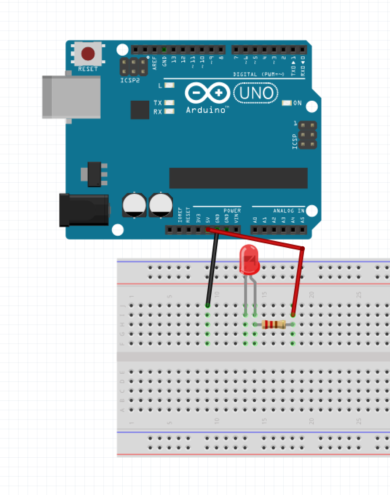
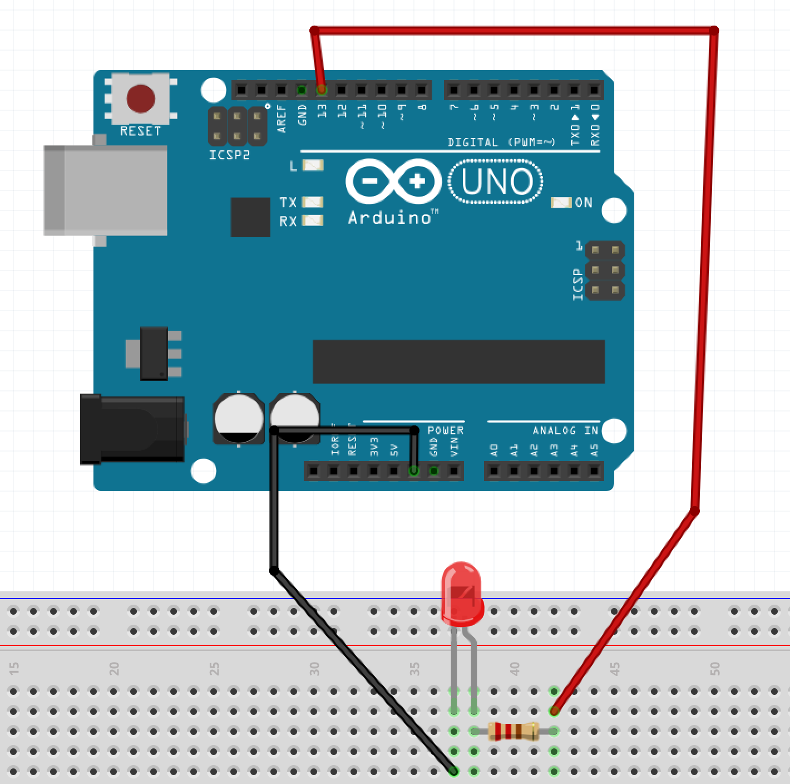
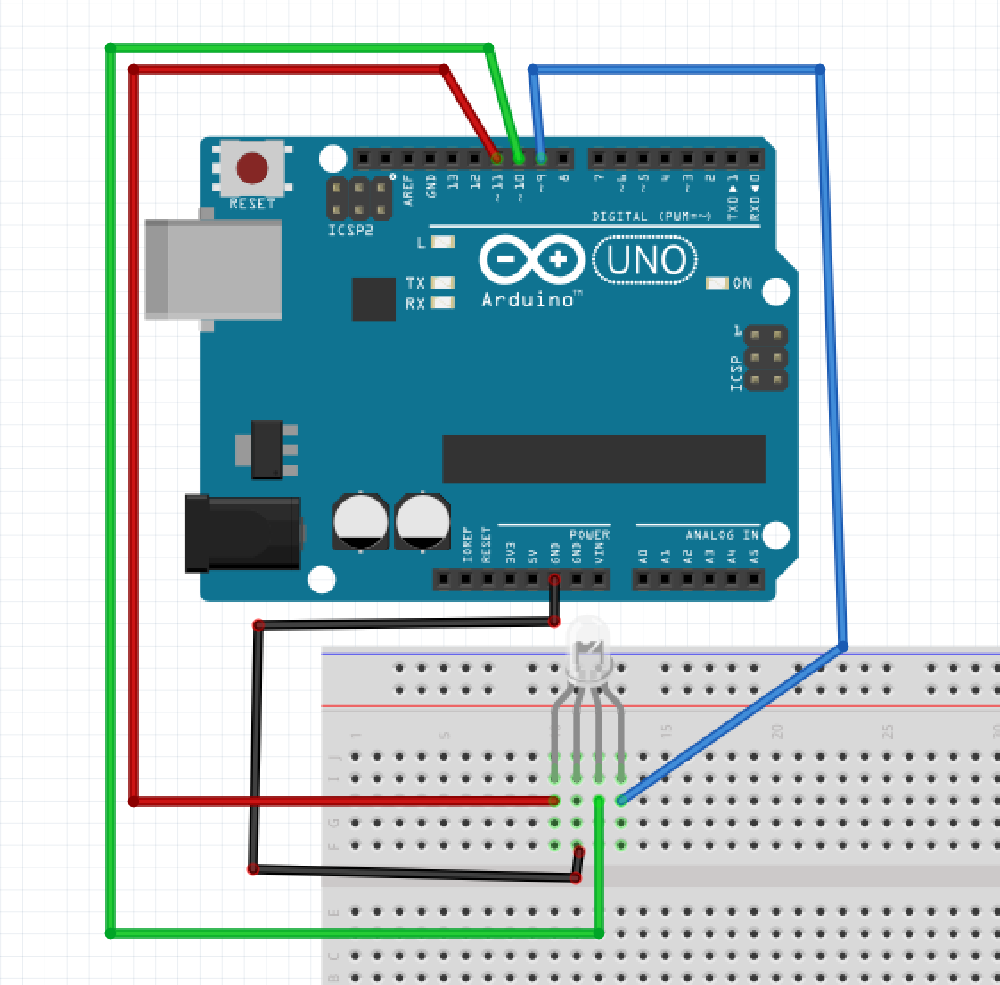
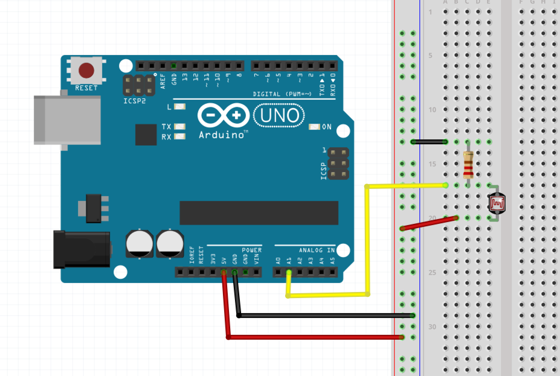

# Hardware hacking
### Objectives
*After this lesson, students will be able to:*

- Explain how an electrical circuit works.
- Follow a wiring diagram for an electronic component.
- Use the Arduino platform to program wired circuits.

## Intro
### What is a circuit?

This can become a pretty long topic but here's all you really need to know about circuits:

A circuit is a closed loop through which current can flow. 

For a much deeper dive: <a href="https://learn.sparkfun.com/tutorials/what-is-a-circuit">What is a circuit? - SparkFun</a>

### A very simple circuit
In each of your kits, you should have a small coin-cell battery (3 volts) and some LEDs.

Wedge the legs of the LED around the battery such that the positive end of the LED (the longer leg) touches the + side of the battery, and the negative end (shorter leg) touches the - side.

### What is a microcontroller?
A microcontroller is basically just a very tiny computer which you can use to program interactions between connected components in a circuit you build.  While it's entirely possible to make an LED blink on/off without the use of any software, what we know as developers is that symbolic systems of representations are never a bad thing -- and if anything, being able to use software to interface with our circuits allow us to approach our designs with all the same principles of modularity and re-usability as we've done so with web apps.

### What is Arduino?
Arduino is an open-sourced prototyping platform for electronics that consists of a microcontroller and a programming interface that makes it extremely easy to get started with hardware hacking.

To get started, we'll need to <a href="https://www.arduino.cc/en/Main/Software">install the Arduino software</a>.

## A very simple Arduino circuit 

Follow the wiring diagram below and plug in the Arduino.  You should see your LED light up!



### Our first programmed circuit: Blink

That's all well and good but we could have easily done this with just a coincell battery.  If we change our wiring just a tiny bit, we can actually program the circuit to blink the LED on/off.

Follow the wiring diagram below, and then open up the Arduino program.



Open up a new sketch and write the following:

```
// the setup function runs once when you press reset or power the board
void setup() {
  // initialize digital pin 13 as an output.
  pinMode(13, OUTPUT);
}

// the loop function runs over and over again forever
void loop() {
  digitalWrite(13, HIGH);   // turn the LED on (HIGH is the voltage level)
  delay(1000);              // wait for a second
  digitalWrite(13, LOW);    // turn the LED off by making the voltage LOW
  delay(1000);              // wait for a second
}
```

Press the Upload button (=> in the top left); you may need to tell the Arduino program what kind of board you have (Arduino Uno) under Tools >> Board and what port it's connected on (dev/tty.usbmodem...) under Tools >> Port.


### Programming in Arduino

There are two functions that are always required for an Arduino program: `setup` and `loop`.  

`setup` is where you put code that runs once at the start of the Arduino -- here, we are setting up our board to be able to send output on pin 13.

`loop` is where you put code that runs, yep, on a loop, while the Arduino board is on.  

Some of this should look kind of familiar to you; other parts won't.  The Arduino language can be thought of as a set of C/C++ functions that you have access to.  That means that by programming for Arduino, you are essentially programming C/C++.

This language is pretty similar to JavaScript even in syntax, but one thing that is definitely very different is in how variables/functions are written.  C/C++ requires that you tell it what **type** of value you expect a variable to store as well as what type you expect a function to return.  Where you don't expect to return anything, you can use `void` (as we've done for both `setup()` and `loop()`).

## Outputs 
### RGB LED
Here's the wiring diagram for an RGB LED:



### Piezo buzzer 
<a href="https://www.arduino.cc/en/Tutorial/toneMelody">Playing a tone with a piezo buzzer</a>


## Inputs 
### Logging
<a href="https://www.arduino.cc/en/Serial/Print">Logging values from Arduino using Serial.print</a>

### Push button
<a href="https://www.arduino.cc/en/Tutorial/Button">Wiring diagram and sketch explanation</a>

### Rotary encoder 
<a href="http://bildr.org/2012/08/rotary-encoder-arduino/">Wiring diagram and detailed explanation of code</a>

### Photocell resistor


### Accelerometer
<a href="https://www.arduino.cc/en/Tutorial/ADXL3xx">Accelerometer wiring and code explanation</a>

## Suggested exploration exercises:
- Control an RGB LED using a rotary encoder or potentiometer.
- Control a piezo buzzer using a rotary encoder, potentiometer, and/or push button.
- Check out noduino and try to get a couple of circuits controlled from the browser.
- Try out the WIFI shield and communicate to the world with the Arduino.
- Make a stitched circuit using the Adafruit Flora; try out the color sensor or GPS components.


## Resources
- <a href="http://makezine.com/comparison/boards/">Make: The Maker's Guide to Boards</a>
- <a href="https://www.arduino.cc/en/Tutorial/HomePage">Arduino tutorials</a> and <a href="https://www.arduino.cc/en/Reference/HomePage">Arduino language reference</a>
- <a href="https://learn.adafruit.com/">Adafruit tutorials</a>
- <a href="https://www.sparkfun.com/tutorials">Sparkfun tutorials</a>
- Project ideas and tutorials over at <a href="http://makezine.com/">Make Magazine</a>
- and for realz... go to a RadioShack

### Where to buy stuff:
- Day-of purchases that can't wait: RadioShack (really!)
- If you know exactly what you need, can wait a while, and want it really cheap: <a href="http://www.digikey.com/">Digikey</a> or <a href="http://www.jameco.com/webapp/wcs/stores/servlet/StoreCatalogDisplay?storeId=10001&catalogId=10001&langId=-1&rfr=1">Jameco</a>
- <a href="http://www.adafruit.com/">Adafruit</a> or <a href="https://www.sparkfun.com/">SparkFun</a> are a little pricier than the above but their sites cater to hobbyists, so they have a lot of documentation and tutorials about all of their products.


